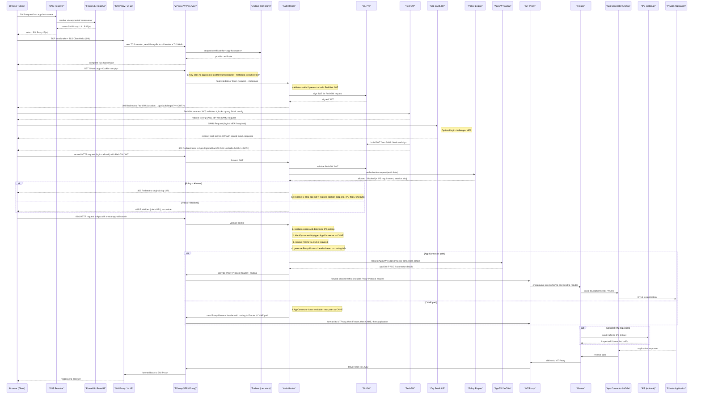
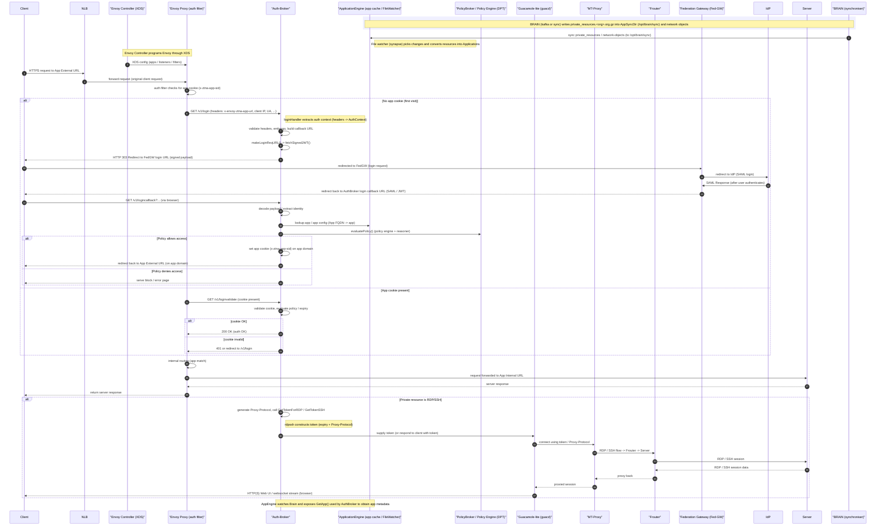
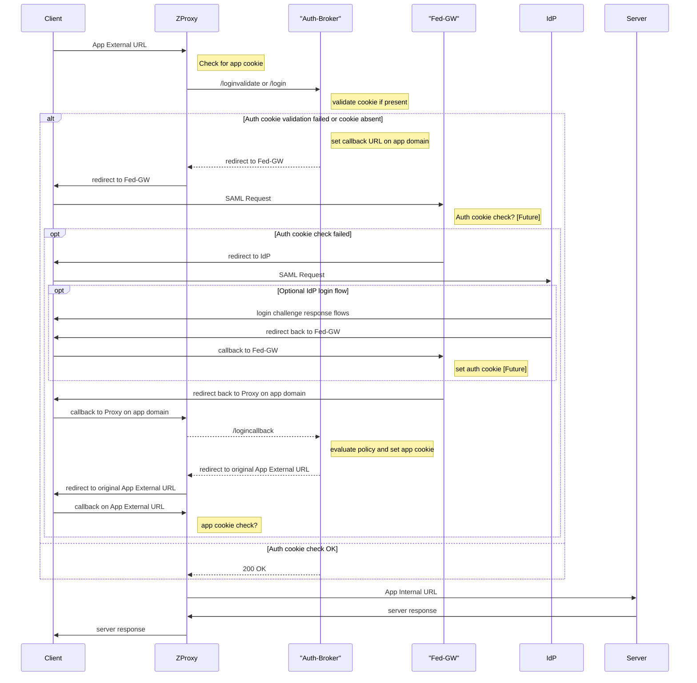

# Architecture

BAP has four major areas that commonly show up in product questions:
- Proxy
- Nidz
- Enclave
- Prometheus

## Proxy

Proxy is the main runtime path for user traffic. It includes:
- Auth-Broker
- Envoy
- Envoy Controller
- Guacd or Guacamole-lite

### Auth-Broker

Auth-Broker handles authentication and authorization orchestration. It works with the Federation Gateway for user login and with the Policy Engine for access decisions.
It also relies on node-local application and rules state populated from Syncer and local file watchers. In the browser login flow, callback handling and later cookie or session validation depend on org-specific rule state being present on the serving node.

### Envoy

Envoy is the main request proxy for HTTP and HTTPS traffic in the ZTNA BAP path.

### Envoy Controller

Envoy Controller is the xDS control plane that programs Envoy listeners, clusters, routes, and filter chains for ZTNA proxy deployments.

### Guacd And Guacamole-lite

These components are involved in RDP and SSH access flows, translating traffic into browser-friendly sessions.

## Nidz

Nidz is the monitoring-facing area. Its core components are:
- nidz-frontend
- nidz-backend
- nidz-api

`nidz-api` includes monitoring and test-script context that is often useful when mapping product behavior to system checks.

## Enclave

Enclave is responsible for certificate management and certificate retrieval used during request handling.

## Repository Links

See `docs/repo_links.md` for canonical GitHub repository URLs.

## Component Buckets

BAP services:
- Envoy Controller
- Envoy Proxy
- Auth-Broker
- Syncer Client
- DPT Policy Engine
- PolicyGen

External services:
- SSE Dashboard
- Unified Policy Service
- BRAIN (Kafka)
- NLB
- Federation Gateway
- FROUTER

## High-Level Request Flow

### HTTP And HTTPS User Flow

1. The client starts a request.
2. Traffic reaches the load-balancing layer.
3. The request lands on a proxy instance.
4. Envoy handles the main HTTP and HTTPS proxying.
5. Envoy calls Auth-Broker for authentication and authorization decisions.
6. Enclave provides certificates used in TLS handling.
7. If the traffic is RDP or SSH, Guacd or Guacamole-lite supports protocol translation.

### Policy Configuration Flow

1. An administrator configures policy in the SSE Dashboard.
2. Unified Policy Service processes the policy definition.
3. BRAIN distributes the policy update.
4. Syncer Client receives the update inside the proxy environment.
5. Policy data is stored locally.
6. PolicyGen converts the stored policy into the required format.
7. Auth-Broker and related services consume local rules data and maintain in-memory state derived from it, such as org-specific rule-hash mappings used in session and cookie paths.
8. Policy Engine ingests the policy for enforcement.
9. Auth-Broker uses Policy Engine decisions during authorization.

Per-node sync completeness matters in this path. If local rules data or derived auth-broker state is missing on one node, login or callback behavior can fail on that node even when the broader environment is healthy.

### User Authorization Flow

1. The user requests an application through the browser.
2. Traffic passes through the NLB to Envoy.
3. Envoy checks for the application session cookie.
4. If the cookie is missing, Envoy forwards login handling to Auth-Broker.
5. Auth-Broker redirects the user through Federation Gateway and the identity provider flow.
6. After successful authentication, Auth-Broker evaluates policy and sets the application cookie.
7. On later requests, Envoy validates the cookie through Auth-Broker before forwarding traffic to the target path.

### User Traffic (LEE Workflow)

- LEE (User) initiates access requests through a web browser.
- NLB distributes incoming traffic to the proxy layer.
- Envoy Proxy acts as the primary data plane component for request routing.
- Envoy Controller manages the lifecycle and dynamic configuration of Envoy Proxy instances.
- Envoy queries Auth-Broker to validate user permissions.
- Federation Gateway handles requests that require external identity or service federation.
- FROUTER delivers authorized traffic to the final destination.

## Detailed Reference Flows

These deeper flow diagrams are useful for architecture and RCA agents because they capture the end-to-end request path, cookie handling, federation flow, policy evaluation, and app-connectivity decisions. They are the right reference when a question is more specific than the high-level summary above.

### Life Cycle Of A BAP Request

### Flow Of A BAP Request With Function Calls

### Authentication And Authorization Flow

## Mental Model For Escalation Questions

Use this simplified mapping when answering CFD questions:
- login and authorization questions usually start with `Auth-Broker`
- request routing and proxying questions usually start with `Envoy`
- dynamic proxy config questions usually start with `Envoy Controller`
- RDP and SSH browser-session questions usually start with `Guacd` or `Guacamole-lite`
- certificate questions usually start with `Enclave`
- monitoring or check-definition questions usually start with `Nidz`
